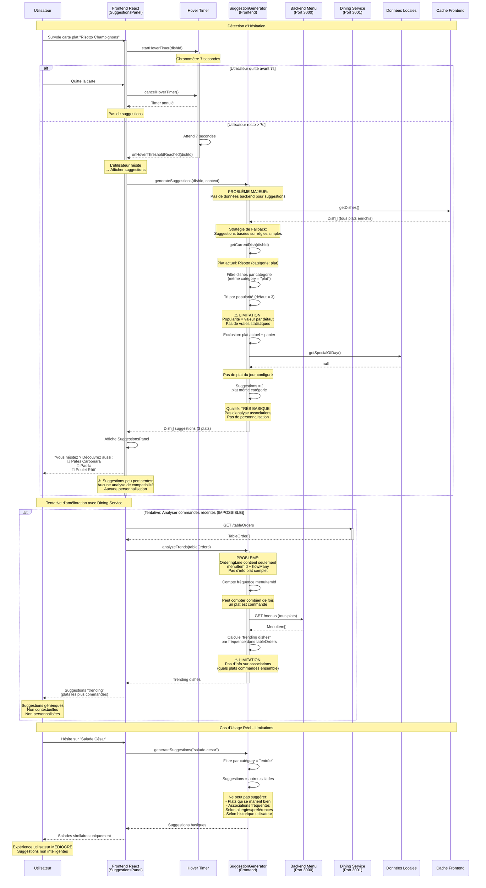

# **CAHIER DES CHARGES - INTÉGRATION BACKEND/FRONTEND**

Projet d'Adaptation des Interfaces Restaurant

**Version** : 4.0  
**Date** : 19 janvier 2026  
**Auteur** : Équipe Technique  
**Contexte** : Adaptation IHM à l'environnement

**Modifications v4.0** :
- Correction des ports (3000, 3001, 3002)
- Correction base de données (MongoDB, pas PostgreSQL)
- Ajout de 12 diagrammes de séquence détaillés
- Vérification de la cohérence avec le backend réel

---

## Table des matières

- [Résumé Exécutif](#résumé-exécutif)
- [I. Contexte et objectifs](#i-contexte-et-objectifs)
- [II. État des Lieux Technique](#ii-état-des-lieux-technique)
- [III. Analyse des Trois Solutions Architecturales avec Diagrammes](#iii-analyse-des-trois-solutions-architecturales)
  - [3.1 Solution 1 : Frontend Manages the Fork](#solution-1-frontend-manages-fork)
  - [3.2 Solution 2 : Backend For Frontend (BFF)](#solution-2-bff)
  - [3.3 Solution 3 : Modification du Backend](#solution-3-backend-modifié)
- [IV. Comparaison Multi-Critères](#iv-comparaison-multi-critères)
- [V. Recommandation et Justification](#v-recommandation-et-justification)
- [VI. Plan d'Implémentation](#vi-plan-dimplémentation)
- [VII. Conclusion](#vii-conclusion)

---

## Résumé Exécutif

Ce rapport analyse trois approches architecturales distinctes pour l'intégration d'un frontend React existant avec un backend NestJS nouvellement fourni. Le frontend, développé initialement avec des données simulées localement, doit être connecté à une API réelle sans perte de fonctionnalités. Les trois solutions étudiées sont : (1) l'adaptation côté frontend (Frontend Manages the Fork), (2) l'utilisation d'une couche intermédiaire BFF (Backend For Frontend), et (3) la modification du backend existant. Chaque approche est évaluée selon des critères de complexité, maintenabilité, performance, coût et évolutivité. Une recommandation finale est formulée sur la base de cette analyse comparative.

---

# I. Contexte et objectifs

Le projet consiste à intégrer deux systèmes développés indépendamment :

**Le frontend existant :**

Une application web React/TypeScript fonctionnelle, développée pour un système de commande en restaurant sur mobile ou tablette par les clients ou un serveur.  

Elle propose deux modes d'interaction distincts :

- **Le mode Standard**, qui comporte des filtres, des suggestions contextuelles de repas et la possibilité de demander à manger rapidement en cas d'affluence (Mode Rush).

- **Le mode Enfant**, qui consiste en une interface ludique avec un système de récompenses.

Actuellement, cette application fonctionne en totale autonomie avec des données simulées localement dans le code source du frontend.

**Le backend fourni :**

Une API REST développée avec NestJS et **MongoDB**, exposant des endpoints pour la gestion des plats et des commandes. Ce backend n'a pas été développé spécifiquement pour notre application et présente donc un décalage entre son modèle de données et celui attendu par l'interface (le backend idéal présenté à mi-projet), particulièrement en ce qui concerne les adaptations de l'interface étant donné qu'elles ont été choisies différemment par chaque groupe d'étudiants.

Dans l'objectif d'intégrer le backend fourni au frontend actuel, nous étudierons dans ce rapport trois méthodes d'intégration possibles :

- Une adaptation côté Frontend
- L'utilisation d'un service intermédiaire BFF (Backend For Frontend)
- Une adaptation des microservices

Dans chaque cas, nous décrirons le workflow et les **diagrammes de séquence** à implémenter pour chacune des adaptations choisies pour notre application à l'étape 1, à savoir :

- Mode Rush
- Mode Enfant
- Suggestions de plat en cas de réflexion prolongée
- Gestion des filtres avancés

---

# II. État des Lieux Technique

## II.1 API du Backend fourni

D'après la documentation swagger déployée localement, le backend NestJS est une architecture microservices avec 3 services distincts :

- **Menu Service** - Gestion des plats au menu (port **3000**, gateway **/menus**)
- **Dining Service** - Gestion des Tables et Commandes (port **3001**, gateway **/tables** et **/tableOrders**)
- **Kitchen Service** - Gestion des Préparations (port **3002**, gateway **/preparations**)
- **Gateway** - Point d'entrée unifié (port **9500**)

> ⚠️ **Note importante** : Le backend utilise **MongoDB** (pas PostgreSQL), visible par la présence du champ `_id` dans les schémas.

### Endpoints concernant notre application :

#### **Menu Service - MenuItem**

**GET /menus**  
Description: Récupère tous les plats du menu  
Response: `MenuItem[]`

**GET /menus/{menuItemId}**  
Description: Récupère un plat par son ID  
Response: `MenuItem`

**POST /menus**  
Description: Crée un nouveau plat  
Body: `CreateMenuItemDto`  
Response: `MenuItem`

**Schema MongoDB MenuItem** :
```json
{
  "_id": "string",
  "fullName": "string",     // Ex: "Steak avec frites maison"
  "shortName": "string",    // Ex: "Steak Frites"
  "price": "number",        // Ex: 18.50
  "category": "string",     // Enum: ["STARTER", "MAIN", "DESSERT", "BEVERAGE"]
  "image": "string"         // URL de l'image
}
```

#### **Dining Service - Table**

**GET /tables**  
Description: Liste toutes les tables du restaurant  
Response: `Table[]`

**POST /tables**  
Description: Ajouter une table au restaurant  
Response: `Table`, ou erreur si table existante

**GET /tables/{tableNumber}**  
Description: Renvoie une table du restaurant  
Response: `Table`

**Schema MongoDB Table** :
```json
{
  "_id": "string",
  "number": "number",
  "taken": "boolean",
  "tableOrderId": "string"
}
```

#### **Dining Service - TableOrder**

**GET /tableOrders**  
Description: Récupère la liste des commandes  
Response: `TableOrder[]`

**POST /tableOrders**  
Description: Crée une commande pour une table  
Body: `{ "tableNumber": number, "customersCount": number }`  
Response: `TableOrder`

**GET /tableOrders/{tableOrderId}**  
Description: Récupère une commande  
Response: `TableOrder`

**POST /tableOrders/{tableOrderId}**  
Description: Ajoute des plats à une commande  
Body: `{ "menuItemId": string, "menuItemShortName": string, "howMany": number }`  
Response: `TableOrder`

**POST /tableOrders/{tableOrderId}/prepare**  
Description: Envoie des plats à la cuisine pour préparation  
Body: `{ "menuItemId": string, "menuItemShortName": string, "howMany": number }`  
Response: `PreparationDto[]`

**POST /tableOrders/{tableOrderId}/bill**  
Description: Confirme la facturation de la commande spécifiée  
Response: `TableOrder`

**Schema MongoDB TableOrder** :
```json
{
  "_id": "string",
  "tableNumber": "number",
  "customersCount": "number",
  "opened": "string (date)",
  "lines": "OrderingLine[]",
  "preparations": "PreparationDto[]",
  "billed": "null || string (date)"
}
```

**Schema MongoDB PreparationDto** :
```json
{
  "_id": "string",
  "shouldBeReadyAt": "string (date)",
  "preparedItems": "OrderingItem[]"
}
```

> **Note** : Le champ `billed` dans `TableOrder` n'est pas encore utilisé par le frontend dans cette version. Il sera exploité dans des évolutions futures pour la gestion de la facturation.

## II.2 Besoins Frontend généraux et par adaptation

### **Adaptation système : Rush Hour Mode**

- **Besoin** : Filtrer les plats par temps de préparation
- **Données manquantes** : 
  - `isQuick` (boolean)
  - `prepTime` (temps de préparation en minutes)
  - `rushStatus` (mode rush activé/désactivé basé sur le nombre de commandes)
- **Logique** : Afficher uniquement les plats avec prepTime ≤ 15min en mode Rush

### **Adaptation à l'âge : Child Mode**

- **Besoin** : Afficher uniquement les plats adaptés aux enfants
- **Données manquantes** :
  - `kidFriendly` (boolean)
  - `ChildModeConfig` (messages de Chef Léo, encouragements)
  - Liste des récompenses (ChildReward)
- **Logique** : Filtrer `kidFriendly === true`, interface simplifiée avec dialogues, système d'étoiles et récompenses

### **Adaptation cognitive : Panel Suggestions**

- **Besoins** :
  - Plat du jour : `isSpecialOfDay` (boolean)
  - Plats populaires : `popularity` (note 1-5)
  - Trending : Statistiques de commandes
- **Données manquantes** : `isSpecialOfDay`, `popularity`, `orderCount`, `lastOrdered`
- **Logique** : Lorsque l'utilisateur reste > 7 secondes sur une carte de plat, suggérer des plats pertinents

### **Adaptation au dispositif : Mode Tablette / Smartphone**

Géré côté frontend, l'inclusion du backend est minime (seulement le numéro de table)

### **Autres besoins**

**Advanced Filters**
- **Besoins** : Filtres diététiques et recherche par ingrédients
- **Données manquantes** :
  - `description`, `subcategory`, `ingredients[]`
  - `isVegetarian`, `isVegan`, `isGlutenFree`
  - `spicyLevel`, `isLight`, `isLocal`
  - `allergens[]`, `cuisine`

**Configuration Générale**
- **Besoins** : Configurer l'application et récupérer la charte graphique
- **Données manquantes** : `RestaurantConfig` (nom, logo, message d'accueil, configuration Rush, features)

## II.3 Synthèse de l'écart entre les deux systèmes

**Écarts identifiés :**

- Absence de **14+ champs** dans MenuItem : `kidFriendly`, `prepTime`, `popularity`, `isQuick`, `ingredients[]`, `isVegetarian`, `isVegan`, `isGlutenFree`, `spicyLevel`, `isLight`, `isLocal`, `hasVegetables`, `isSpecialOfDay`, `cuisine`
- **Catégories incompatibles** : Backend utilise `STARTER/MAIN/DESSERT/BEVERAGE` vs Frontend attend `"entrée"/"plat"/"dessert"` + subcategory
- **Absence de l'entité ChildReward** : Aucune collection pour les récompenses du mode enfant
- **Absence d'endpoint `/rush-status`** : Pas de détection dynamique du nombre de commandes
- **Absence d'endpoint `/restaurant-config`** : Configuration non accessible via API
- **Absence d'endpoint `/recommendations`** : Système de suggestions non implémenté

| Fonctionnalité | Frontend (attendu) | Backend (fourni) | Écart |
|----------------|-------------------|------------------|--------|
| **Endpoint plats** | GET /api/dishes | GET /menus | Nom différent |
| **Champs MenuItem** | 20+ champs | 6 champs | **14+ champs manquants** |
| **Catégories** | "entrée"/"plat"/"dessert" + subcategory | "STARTER"/"MAIN"/"DESSERT"/"BEVERAGE" | Format incompatible |
| **Récompenses enfant** | GET /api/child-rewards | Inexistant | **Entité + endpoint manquants** |
| **Configuration** | GET /api/restaurant-config | Inexistant | **Endpoint manquant** |
| **Statut Rush** | GET /api/rush-status (polling 10s) | Inexistant | **Endpoint manquant** |
| **Recommandations** | POST /api/recommendations | Inexistant | **Endpoint manquant** |
| **Type de BDD** | Format frontend flexible | **MongoDB** avec _id | Adaptation nécessaire |

Cet écart important nécessite une stratégie d'adaptation robuste pour réconcilier les deux systèmes.

---

# III. Analyse des Trois Solutions Architecturales avec Diagrammes

<a name="solution-1-frontend-manages-fork"></a>
## 3.1 Solution 1 : Frontend Manages the Fork (Adaptation côté Frontend)

### Description de la solution

Cette approche consiste à gérer l'adaptation des données entièrement côté frontend. Le frontend interroge le backend existant sans modification, puis enrichit, transforme et complète les données reçues avant de les utiliser dans les composants React.

**Architecture :**
```
Backend NestJS (inchangé) → Service d'Adaptation Frontend → Composants React
                              ↓
                    Données Locales Statiques
                    (restaurant-data.ts)
```

**Principe de fonctionnement :**

1. Le frontend appelle l'API backend existante (`GET /menus`)
2. Une couche d'adaptation côté frontend transforme les données :
   - Ajoute les champs manquants avec des valeurs par défaut
   - Enrichit certains champs à partir de données locales complémentaires
   - Calcule des valeurs via des heuristiques (ex: détection kidFriendly par mots-clés)
3. Les données transformées sont passées aux composants React

Pour les données totalement absentes du backend (récompenses enfant, configuration), elles restent stockées localement dans `/data/restaurant-data.ts`.

### Implémentation détaillée avec Diagrammes de Séquence

#### 3.1.1 Mode Rush - Diagramme de Séquence

Le mode Rush doit activer automatiquement une interface simplifiée lorsque le restaurant est en période d'affluence, en proposant uniquement des plats rapides à préparer.

```
title Solution 1 - Mode Rush (Adaptation Frontend)

participant Utilisateur
participant Frontend React
participant RushService (Local)
participant DishAdapter (Frontend)
participant Backend Menu\nhttp://localhost:3000
participant Dining Service\nhttp://localhost:3001
participant Données Locales\n(restaurant-data.ts)

    Note over FE,Local: Initialisation du Mode Rush

    User->>FE: Ouvre l'application
    activate FE
    
    FE->>RS: checkRushStatus()
    activate RS
    Note over RS: Polling toutes les 10s
    
    RS->>+DI: HTTP GET /tableOrders<br/>Accept: application/json
    Note over DI: Récupère TOUTES les commandes<br/>(ouvertes + fermées)
    DI-->>-RS: 200 OK<br/>Content-Type: application/json<br/>[<br/>  {<br/>    "_id": "order123",<br/>    "tableNumber": 5,<br/>    "customersCount": 4,<br/>    "opened": "2026-01-19T12:30:00Z",<br/>    "billed": null,<br/>    "lines": [...],<br/>    "preparations": [...]<br/>  },<br/>  ...<br/>]
    
    RS->>RS: const openOrders = tableOrders.filter(<br/>  order => order.billed === null<br/>)<br/>const count = openOrders.length
    Note over RS: Compte = 15 commandes ouvertes
    
    alt count > 10
        RS-->>FE: { isRushMode: true, ordersCount: 15 }
        Note over FE: Mode Rush ACTIVÉ
        FE->>FE: setState({ rushMode: true })<br/>Affiche bannière rouge<br/>"⚠️ Affluence - Plats rapides"
    else count ≤ 10
        RS-->>FE: { isRushMode: false, ordersCount: 8 }
        Note over FE: Mode Normal
    end
    deactivate RS

    Note over FE,BE: Chargement des Plats depuis Backend

    FE->>+BE: HTTP GET /menus<br/>Accept: application/json
    Note over BE: Récupère tous les plats du menu
    BE-->>-FE: 200 OK<br/>Content-Type: application/json<br/>[<br/>  {<br/>    "_id": "673abc123",<br/>    "fullName": "Salade César",<br/>    "shortName": "César",<br/>    "price": 12.50,<br/>    "category": "STARTER",<br/>    "image": "https://..."<br/>  },<br/>  {<br/>    "_id": "673abc456",<br/>    "fullName": "Pizza Margherita",<br/>    "shortName": "Margherita",<br/>    "price": 14.00,<br/>    "category": "MAIN",<br/>    "image": "https://..."<br/>  },<br/>  ...<br/>]

    FE->>DA: enrichMenuItems(menuItems, isRushMode: true)
    activate DA
    
    loop Pour chaque MenuItem
        DA->>DA: estimatePrepTime(item.fullName)
        Note over DA: Heuristique basique:<br/>if (name.includes("salade")) → 10min<br/>if (name.includes("pizza")) → 20min<br/>if (name.includes("grillé")) → 25min<br/>default → 15min
        
        DA->>DA: isQuick = (prepTime <= 15)
        Note over DA: ⚠️ PROBLÈME: Estimation imprécise<br/>Pizza = 20min → isQuick = false<br/>Mais en réalité peut être rapide
        
        DA->>Local: getEnrichmentData(item.shortName)
        activate Local
        alt Mapping existe
            Local-->>DA: {<br/>  prepTime: 12,<br/>  ingredients: ["salade", "poulet"],<br/>  isVegetarian: false,<br/>  ...<br/>}
        else Pas de mapping
            Local-->>DA: null
        end
        deactivate Local
        
        DA->>DA: const enrichedDish = {<br/>  id: item._id,<br/>  name: item.fullName,<br/>  description: item.shortName,<br/>  category: convertCategory(item.category),<br/>  subcategory: item.category,<br/>  price: item.price,<br/>  imageUrl: item.image,<br/>  prepTime: enrichment?.prepTime || estimated,<br/>  isQuick: (prepTime <= 15),<br/>  popularity: 3, // défaut<br/>  kidFriendly: false, // défaut<br/>  ingredients: enrichment?.ingredients || [],<br/>  isVegetarian: enrichment?.isVegetarian || false,<br/>  ...<br/>}
    end
    
    alt isRushMode === true
        DA->>DA: dishes = dishes.filter(d => d.isQuick === true)
        Note over DA: ⚠️ LIMITATION CRITIQUE:<br/>Filtre basé sur estimation<br/>Risque d'exclure plats rapides<br/>ou inclure plats lents
    end
    
    DA-->>FE: Dish[] enrichis et filtrés<br/>[<br/>  { id: "673abc123", name: "Salade César",<br/>    prepTime: 10, isQuick: true, ... },<br/>  { id: "673abc789", name: "Omelette",<br/>    prepTime: 8, isQuick: true, ... },<br/>  ...<br/>]
    deactivate DA

    FE->>FE: Rendu composant MenuView<br/>Affiche uniquement plats rapides
    FE-->>User: Interface avec 12 plats filtrés<br/>(au lieu de 35 totaux)
    deactivate FE

    Note over FE,DI: Actualisation continue (Polling toutes les 10s)
    
    loop Toutes les 10 secondes
        FE->>RS: checkRushStatus()
        activate RS
        RS->>+DI: HTTP GET /tableOrders<br/>Accept: application/json
        DI-->>-RS: 200 OK<br/>[...tableOrders...]
        RS->>RS: Recompte commandes ouvertes<br/>count = 8 (diminué)
        RS-->>FE: { isRushMode: false, ordersCount: 8 }
        deactivate RS
        
        alt Changement de mode (Rush → Normal)
            FE->>FE: setState({ rushMode: false })<br/>Masque bannière Rush
            FE->>DA: enrichMenuItems(menuItems, isRushMode: false)
            DA-->>FE: Dish[] complets (non filtrés)
            FE->>FE: Re-rendu avec tous les plats
            FE-->>User: Interface normale (35 plats)
        end
    end
```

**Analyse de la Solution 1 pour le Mode Rush :**

✅ **Avantages :**
- Pas de modification backend
- Polling fonctionnel (détection dynamique)
- Activation automatique basée sur nombre réel de commandes

❌ **Limitations critiques :**
- **prepTime estimé par heuristique** : Imprécis, basé uniquement sur des mots-clés dans le nom
- **isQuick calculé incorrectement** : Risque d'afficher des plats longs en mode Rush
- **Pas de temps réel de cuisine** : Ne peut pas récupérer les vrais temps de préparation du Kitchen Service
- **Données locales limitées** : Nécessite maintenance manuelle du mapping shortName → prepTime

**Qualité fonctionnelle : 3/10** - Mode Rush actif mais plats filtrés de manière peu fiable

---

#### 3.1.2 Mode Enfant (Chef Léo) - Diagramme de Séquence

Le mode Enfant propose une interface ludique avec Chef Léo, un système d'étoiles, et des récompenses à débloquer.

```mermaid
sequenceDiagram
    participant Child as Enfant
    participant FE as Frontend React<br/>(ChildMode)
    participant DA as DishAdapter
    participant BE as Backend Menu<br/>http://localhost:3000
    participant DI as Dining Service<br/>http://localhost:3001
    participant Local as Données Locales<br/>(restaurant-data.ts)
    participant State as State Management<br/>(React Context)

    Note over Child,State: Activation du Mode Enfant

    Child->>FE: Clique bouton "Mode Enfant 👶"
    activate FE
    
    FE->>Local: loadChildModeConfig()
    activate Local
    Local-->>FE: {<br/>  chefLeoMessages: {<br/>    welcome: "Bonjour petit chef ! 👨‍🍳",<br/>    entrée: "Super choix ! +2 étoiles ⭐⭐",<br/>    plat: "Excellent ! +4 étoiles ⭐⭐⭐⭐",<br/>    dessert: "Miam ! +2 étoiles ⭐⭐",<br/>    complete: "Bravo champion ! 🏆",<br/>    ...<br/>  },<br/>  encouragements: [<br/>    "Tu es un super chef !",<br/>    "Continue comme ça !",<br/>    ...<br/>  ]<br/>}
    deactivate Local
    
    FE->>Local: loadChildRewards()
    activate Local
    Local-->>FE: ChildReward[]<br/>[<br/>  { id: "lollipop", name: "Sucette",<br/>    emoji: "🍭", stars: 3 },<br/>  { id: "icecream", name: "Glace",<br/>    emoji: "🍦", stars: 6 },<br/>  { id: "candy", name: "Bonbon",<br/>    emoji: "🍬", stars: 3 },<br/>  ...<br/>]
    deactivate Local
    
    FE->>State: initChildState({ stars: 0, selectedRewards: [] })
    activate State
    State-->>FE: État initialisé
    deactivate State
    
    FE->>FE: setState({ mode: 'child' })<br/>Affiche interface ludique
    FE-->>Child: "Bonjour petit chef ! 👨‍🍳"

    Note over FE,BE: Chargement des Plats Enfants

    FE->>+BE: HTTP GET /menus<br/>Accept: application/json
    Note over BE: Récupère TOUS les plats (adultes + enfants)
    BE-->>-FE: 200 OK<br/>Content-Type: application/json<br/>[<br/>  {<br/>    "_id": "673abc111",<br/>    "fullName": "Nuggets de poulet avec frites",<br/>    "shortName": "Nuggets",<br/>    "price": 8.50,<br/>    "category": "MAIN",<br/>    "image": "https://..."<br/>  },<br/>  {<br/>    "_id": "673abc222",<br/>    "fullName": "Pizza Margherita",<br/>    "shortName": "Pizza",<br/>    "price": 10.00,<br/>    "category": "MAIN",<br/>    "image": "https://..."<br/>  },<br/>  {<br/>    "_id": "673abc333",<br/>    "fullName": "Steak tartare au couteau",<br/>    "shortName": "Tartare",<br/>    "price": 22.00,<br/>    "category": "MAIN",<br/>    "image": "https://..."<br/>  },<br/>  ...<br/>]

    FE->>DA: enrichMenuItems(menuItems, {<br/>  isChildMode: true,<br/>  filterKidFriendly: true<br/>})
    activate DA
    
    loop Pour chaque MenuItem
        DA->>DA: detectKidFriendly(item.fullName)
        Note over DA: const kidKeywords = [<br/>  'nuggets', 'frites', 'pizza',<br/>  'pâtes', 'glace', 'poulet',<br/>  'omelette', 'crêpe'<br/>]<br/>const lowerName = name.toLowerCase()<br/>return kidKeywords.some(kw => <br/>  lowerName.includes(kw))
        
        alt "Nuggets de poulet avec frites"
            DA->>DA: kidFriendly = true ✅
            Note over DA: Contient "nuggets" ET "frites"
        else "Pizza Margherita"
            DA->>DA: kidFriendly = true ✅
            Note over DA: Contient "pizza"
        else "Steak tartare au couteau"
            DA->>DA: kidFriendly = false ❌
            Note over DA: Aucun mot-clé détecté<br/>⚠️ PROBLÈME: Peut être adapté<br/>mais non détecté
        end
        
        DA->>Local: getEnrichmentData(item.shortName)
        activate Local
        alt Mapping existe
            Local-->>DA: {<br/>  kidFriendly: true, // Override<br/>  kidFriendlyDescription: "...",<br/>  ...<br/>}
        else Pas de mapping
            Local-->>DA: null<br/>(Utilise détection heuristique)
        end
        deactivate Local
        
        DA->>DA: const enrichedDish = {<br/>  id: item._id,<br/>  name: item.fullName,<br/>  description: item.shortName,<br/>  category: convertCategory(item.category),<br/>  price: item.price,<br/>  imageUrl: item.image,<br/>  kidFriendly: enrichment?.kidFriendly<br/>    || heuristicDetection,<br/>  ...<br/>}
    end
    
    DA->>DA: const kidDishes = dishes.filter(<br/>  d => d.kidFriendly === true<br/>)
    Note over DA: Résultat: 12 plats sur 35<br/>⚠️ Risque: Plats inadaptés inclus<br/>ou plats adaptés exclus
    
    DA-->>FE: Dish[] filtrés kidFriendly<br/>[<br/>  { id: "673abc111", name: "Nuggets...",<br/>    kidFriendly: true, ... },<br/>  { id: "673abc222", name: "Pizza...",<br/>    kidFriendly: true, ... },<br/>  ...<br/>]
    deactivate DA

    FE->>FE: Rendu composant ChildMode<br/>Affiche grille 2x2<br/>Grandes images, texte simple
    FE-->>Child: Interface ludique avec 12 plats enfants

    Note over Child,State: Sélection d'un Plat

    Child->>FE: Clique sur plat "Nuggets de Poulet"<br/>(catégory = "plat")
    activate FE
    
    FE->>State: cart.addItem({ dishId, quantity: 1 })
    State-->>FE: Item ajouté au panier
    
    FE->>State: getStars()
    State-->>FE: currentStars = 2 (avait déjà une entrée)
    
    FE->>State: addStars(4) // Plat principal
    activate State
    State->>State: stars = 2 + 4 = 6
    State-->>FE: { stars: 6 }
    deactivate State
    
    FE->>FE: Affiche animation "+4 ⭐⭐⭐⭐"
    FE->>Local: getRandomEncouragement()
    Local-->>FE: "Continue comme ça !"
    FE-->>Child: Message Chef Léo:<br/>"Excellent ! +4 étoiles ⭐⭐⭐⭐<br/>Continue comme ça !"
    
    deactivate FE

    Note over Child,State: Échange d'Étoiles contre Récompenses

    Child->>FE: Clique sur bouton "🎁 Mes Récompenses"<br/>(Badge: "6 étoiles")
    activate FE
    
    FE->>State: getStars()
    State-->>FE: currentStars = 6
    
    FE->>Local: loadChildRewards()
    Local-->>FE: ChildReward[] (5-6 récompenses)
    
    FE->>FE: const affordable = rewards.filter(<br/>  r => r.stars <= currentStars<br/>)<br/>// affordable = [lollipop(3), candy(3), icecream(6)]
    
    FE-->>Child: Affiche modal récompenses<br/>✅ Sucette 🍭 (3 ⭐)<br/>✅ Bonbon 🍬 (3 ⭐)<br/>✅ Glace 🍦 (6 ⭐)<br/>🔒 Crêpe 🥞 (8 ⭐) - Pas assez

    Child->>FE: Sélectionne "Glace 🍦" (6 étoiles)
    
    FE->>State: canAffordReward("icecream", 6)
    State-->>FE: true (6 étoiles >= 6 requises)
    
    FE->>State: deductStars(6)
    activate State
    State->>State: stars = 6 - 6 = 0
    State-->>FE: { stars: 0 }
    deactivate State
    
    FE->>State: cart.addItem({<br/>  id: "reward-icecream",<br/>  name: "Glace 🍦 (récompense)",<br/>  price: 0,<br/>  isReward: true<br/>})
    State-->>FE: Récompense ajoutée au panier
    
    FE->>FE: Affiche animation confettis 🎉
    FE-->>Child: "🎉 Tu as gagné une Glace ! 🍦"
    
    deactivate FE

    Note over Child,DI: Validation de la Commande

    Child->>FE: Clique sur "Valider ma commande ✅"
    activate FE
    
    FE->>+DI: HTTP POST /tableOrders<br/>Content-Type: application/json<br/>{<br/>  "tableNumber": 5,<br/>  "customersCount": 1<br/>}
    Note over DI: Crée une nouvelle commande
    DI-->>-FE: 201 Created<br/>Content-Type: application/json<br/>{<br/>  "_id": "order789",<br/>  "tableNumber": 5,<br/>  "customersCount": 1,<br/>  "opened": "2026-01-19T13:45:00Z",<br/>  "billed": null,<br/>  "lines": [],<br/>  "preparations": []<br/>}
    
    FE->>FE: const orderId = "order789"
    
    loop Pour chaque item du panier
        alt item.isReward === false (Plat normal)
            FE->>+DI: HTTP POST /tableOrders/order789<br/>Content-Type: application/json<br/>{<br/>  "menuItemId": "673abc111",<br/>  "menuItemShortName": "Nuggets",<br/>  "howMany": 1<br/>}
            DI-->>-FE: 200 OK<br/>{<br/>  "_id": "order789",<br/>  "lines": [<br/>    {<br/>      "item": {<br/>        "_id": "673abc111",<br/>        "shortName": "Nuggets"<br/>      },<br/>      "howMany": 1,<br/>      "sentForPreparation": false<br/>    }<br/>  ],<br/>  ...<br/>}
        else item.isReward === true (Récompense)
            Note over FE: ⚠️ Récompense NON envoyée au backend<br/>Gestion locale uniquement<br/>Pas de trace serveur<br/>Prix = 0 (gratuit)
        end
    end
    
    FE->>FE: localStorage.setItem(<br/>  'childModeStats',<br/>  JSON.stringify({<br/>    orderId: "order789",<br/>    starsEarned: 6,<br/>    rewardsSelected: ["icecream"]<br/>  })<br/>)
    Note over FE: Stockage local pour tracking<br/>Mais pas envoyé au backend
    
    FE->>FE: Affiche écran succès
    FE-->>Child: Message Chef Léo "complete":<br/>"Bravo champion ! 🏆<br/>Ta commande arrive bientôt !"
    
    FE->>State: resetChildState()
    activate State
    State->>State: stars = 0<br/>selectedRewards = []<br/>cart = []
    State-->>FE: État réinitialisé
    deactivate State
    
    deactivate FE
```



**Analyse de la Solution 1 pour le Mode Enfant :**

✅ **Avantages :**
- Système d'étoiles fonctionnel
- Récompenses gérées localement
- Messages Chef Léo personnalisables
- Pas de modification backend

❌ **Limitations critiques :**
- **kidFriendly détecté par heuristique** : Imprécis, basé uniquement sur mots-clés
  - Risque faux positifs : "Pizza pimentée" détecté comme kidFriendly
  - Risque faux négatifs : "Filet de sole" non détecté malgré adaptation enfant
- **Récompenses non synchronisées** : Stockées localement, impossible à partager entre dispositifs
- **Pas de validation backend** : Les récompenses ne sont pas enregistrées côté serveur
- **Maintenance manuelle** : Chaque nouveau plat nécessite mise à jour manuelle

**Qualité fonctionnelle : 4/10** - Mode ludique fonctionnel mais données peu fiables

---

#### 3.1.3 Suggestions Intelligentes - Diagramme de Séquence

Les suggestions doivent apparaître lorsque l'utilisateur hésite sur un plat, en proposant des alternatives pertinentes.



**Analyse de la Solution 1 pour les Suggestions :**

✅ **Avantages :**
- Détection d'hésitation fonctionnelle (timer 7s)
- Interface suggestion implémentable
- Pas de modification backend

❌ **Limitations CRITIQUES :**
- **Pas de données d'association** : Impossible de savoir quels plats sont commandés ensemble
- **Popularité fictive** : Valeur par défaut (3), pas de vraies statistiques
- **Pas d'historique utilisateur** : Aucune personnalisation possible
- **Suggestions basiques** : Uniquement même catégorie, tri arbitraire
- **Pas de plat du jour** : Impossible à identifier sans données backend
- **Pas d'analyse de compatibilité** : Ne peut pas suggérer entrée + plat + dessert cohérents
- **Pas de contexte** : Ne prend pas en compte allergies, régime, mode actif

**Qualité fonctionnelle : 2/10** - Fonctionnalité quasi inexistante, suggestions aléatoires

**Verdict Solution 1 :** Cette approche rend les suggestions **non viables**. Il s'agit d'un désavantage majeur pour l'expérience utilisateur.

---

#### 3.1.4 Gestion des Filtres Avancés - Diagramme de Séquence

Les filtres avancés permettent de filtrer les plats par régime alimentaire, ingrédients, allergènes, niveau de piment, etc.

```mermaid
sequenceDiagram
    participant User as Utilisateur
    participant FE as Frontend React<br/>(AdvancedFilters)
    participant FM as FilterManager<br/>(Frontend)
    participant DA as DishAdapter
    participant BE as Backend Menu<br/>(Port 3000)
    participant Local as Données Locales<br/>(enrichment)
    participant Cache as Cache Frontend

    Note over User,Cache: Ouverture de l'Interface de Filtrage

    User->>FE: Clique sur "Filtres avancés"
    activate FE
    
    FE->>FE: Affiche panneau filtres
    FE-->>User: Interface avec options:<br/>☐ Végétarien<br/>☐ Végan<br/>☐ Sans gluten<br/>☐ Produits locaux<br/>☐ Plats légers<br/>🌶️ Niveau piment<br/>🔍 Recherche ingrédients

    Note over User,FE: Application des Filtres

    User->>FE: Coche "Végétarien"
    User->>FE: Sélectionne "Sans gluten"
    User->>FE: Tape "tomate" dans recherche ingrédients
    
    FE->>FM: applyFilters({<br/>  isVegetarian: true,<br/>  isGlutenFree: true,<br/>  includeIngredients: ["tomate"]<br/>})
    activate FM
    
    FM->>Cache: getAllDishes()
    activate Cache
    Cache-->>FM: Dish[] (tous plats enrichis)
    deactivate Cache
    
    Note over FM: PROBLÈME: Données enrichies<br/>par heuristiques peu fiables

    loop Pour chaque Dish
        FM->>FM: Vérifie dish.isVegetarian
        Note over FM: ⚠️ Valeur estimée par DishAdapter<br/>Peut être incorrecte
        
        alt isVegetarian === false
            FM->>FM: Exclut ce plat
        else isVegetarian === true
            FM->>FM: Vérifie dish.isGlutenFree
            Note over FM: ⚠️ Valeur estimée ou par défaut
            
            alt isGlutenFree === false
                FM->>FM: Exclut ce plat
            else isGlutenFree === true
                FM->>FM: Vérifie dish.ingredients[]
                Note over FM: ⚠️ Ingrédients extraits<br/>du shortName ou données locales
                
                alt ingredients.includes("tomate")
                    FM->>FM: Garde ce plat (filtre OK)
                else
                    FM->>FM: Exclut ce plat
                end
            end
        end
    end
    
    FM-->>FE: Dish[] filtrés
    deactivate FM
    
    Note over FE: Risque: Liste vide ou plats inadaptés
    
    alt Résultats > 0
        FE-->>User: Affiche X plats correspondants
        Note over User: Peut contenir des erreurs<br/>si données enrichies incorrectes
    else Résultats === 0
        FE-->>User: "Aucun plat ne correspond<br/>à vos critères"
        Note over User: Peut être faux négatif<br/>si données mal enrichies
    end
    
    deactivate FE

    Note over User,Local: Enrichissement des Données - Détail du Processus

    Note over BE,Local: Moment de l'enrichissement initial

    FE->>BE: GET /menus
    activate BE
    BE-->>FE: MenuItem[] (6 champs de base)
    deactivate BE
    
    FE->>DA: enrichMenuItems(menuItems)
    activate DA
    
    loop Pour chaque MenuItem
        DA->>DA: Analyse fullName et shortName
        Note over DA: Tentative extraction ingrédients
        
        alt Nom contient indices
            DA->>DA: extractIngredients(fullName)
            Note over DA: Ex: "Salade tomate mozzarella"<br/>→ ["salade", "tomate", "mozzarella"]
        else Nom peu descriptif
            DA->>Local: getIngredientsMapping(shortName)
            Local-->>DA: ingredients[] si mapping existe
            Note over DA: ⚠️ Si pas de mapping:<br/>ingredients = []
        end
        
        DA->>DA: detectVegetarian(name, ingredients)
        Note over DA: Heuristique basée sur mots-clés:<br/>- Contient "viande", "poulet", "bœuf" → false<br/>- Contient "légumes", "salade" → true<br/>- Défaut → false
        
        DA->>DA: detectGlutenFree(name, ingredients)
        Note over DA: Heuristique basée sur mots-clés:<br/>- Contient "pain", "pâtes", "pizza" → false<br/>- Sinon → undefined (inconnu)
        
        DA->>Local: getEnrichmentData(shortName)
        activate Local
        alt Données disponibles localement
            Local-->>DA: {<br/>  isVegetarian: true,<br/>  isGlutenFree: false,<br/>  ingredients: [...],<br/>  allergens: [...],<br/>  spicyLevel: 0,<br/>  ...  <br/>}
        else Pas de données
            Local-->>DA: null
            Note over DA: Utilise valeurs heuristiques
        end
        deactivate Local
        
        DA->>DA: Construit Dish complet avec:<br/>- Champs backend<br/>- Champs estimés<br/>- Champs par défaut<br/>- Champs enrichis si disponibles
        
        Note over DA: Qualité variable selon disponibilité<br/>des données d'enrichissement local
    end
    
    DA-->>FE: Dish[] enrichis
    deactivate DA
    
    FE->>Cache: storeDishes(enrichedDishes)
    Cache-->>FE: Dishes en cache

    Note over User,Cache: Cas d'Usage Réel - Problèmes

    User->>FE: Active filtre "Végan"
    FE->>FM: applyFilters({ isVegan: true })
    
    FM->>Cache: getAllDishes()
    Cache-->>FM: Dish[]
    
    FM->>FM: Filtre dishes.filter(d => d.isVegan)
    Note over FM: Problème 1: isVegan estimé par heuristique<br/>Problème 2: Risque faux positifs<br/>(plat contient produits laitiers non détectés)
    
    FM-->>FE: Résultats filtrés
    FE-->>User: Affiche plats "végan"
    Note over User: ⚠️ Risque allergies/intolérances<br/>si données incorrectes

    User->>FE: Recherche "sans lactose"
    Note over FE: ❌ IMPOSSIBLE:<br/>Champ "lactose" non existant<br/>Pas de données allergènes détaillées
    FE-->>User: Aucun résultat ou résultats imprécis

    User->>FE: Recherche "piment"
    FE->>FM: applyFilters({ includeIngredients: ["piment"] })
    FM->>FM: Filtre par ingredients.includes("piment")
    Note over FM: Problème: spicyLevel existe<br/>mais recherche textuelle moins précise
    FM-->>FE: Résultats
    FE-->>User: Plats contenant "piment"
    Note over User: Mieux: utiliser spicyLevel<br/>mais nécessite UI adaptée

    Note over User,Cache: Limitations Structurelles

    Note over FM: IMPOSSIBLE dans cette solution:<br/>- Allergènes précis (lactose, fruits à coque)<br/>- Valeurs nutritionnelles<br/>- Certifications (bio, label rouge)<br/>- Provenance exacte des ingrédients<br/>- Modes de cuisson<br/>- Associations déconseillées
```



**Analyse de la Solution 1 pour les Filtres Avancés :**

✅ **Avantages :**
- Interface de filtrage implémentable
- Recherche par ingrédients fonctionnelle (si données disponibles)
- Performance correcte (filtrage côté client)
- Pas de modification backend

❌ **Limitations importantes :**
- **Données diététiques estimées** : `isVegetarian`, `isVegan`, `isGlutenFree` calculés par heuristiques
  - Risque sanitaire : Allergies non détectées, intolérances ignorées
- **Ingrédients incomplets** : Extraction depuis nom du plat, peut manquer des ingrédients clés
- **Pas d'allergènes détaillés** : Liste basique ou vide
- **Subcategory manquante** : Impossible de filtrer par type précis (viandes, poissons, etc.)
- **Cuisine non identifiable** : Type de cuisine (française, italienne) inconnu
- **spicyLevel aléatoire** : Niveau de piment estimé ou par défaut
- **isLocal inconnu** : Impossible de savoir si produits locaux
- **Maintenance complexe** : Nécessite fichier d'enrichissement local à jour

**Qualité fonctionnelle : 4/10** - Filtres basiques fonctionnels mais données peu fiables, **risque sanitaire**

---

### Synthèse de la Solution 1

**Résumé des 4 Diagrammes :**

| Adaptation | Qualité | Limitations Principales |
|-----------|---------|-------------------------|
| **Mode Rush** | 3/10 | prepTime estimé, isQuick imprécis, plats inadaptés affichés |
| **Mode Enfant** | 4/10 | kidFriendly par heuristique, faux positifs/négatifs, récompenses locales |
| **Suggestions** | 2/10 | Aucune donnée d'association, suggestions aléatoires, non personnalisées |
| **Filtres Avancés** | 4/10 | Données diététiques estimées, risque sanitaire, ingrédients incomplets |

**Verdict Global Solution 1 :**

Cette approche permet une **mise en œuvre rapide (1-2 semaines)** mais compromet **gravement la qualité fonctionnelle** de l'application. Les adaptations clés (Mode Enfant, Mode Rush, Suggestions) sont **dégradées** voire **non viables**.

**Points critiques :**
- ❌ Données peu fiables (heuristiques)
- ❌ Risque sanitaire (allergènes non détectés)
- ❌ Expérience utilisateur médiocre (suggestions aléatoires)
- ❌ Maintenance complexe (données locales à synchroniser)
- ❌ Dette technique élevée

**Recommandation :** Solution acceptable uniquement pour un **prototype rapide** ou si backend **absolument non modifiable**. Non recommandée pour production.

---

